# ai-orchestrator

[](https://github.com/Mybono/ai-orchestrator/actions/workflows/ci.yml)
[](https://opensource.org/licenses/MIT)

**README** · [Architecture](documentation/ARCHITECTURE.md) · [Agents](documentation/AGENTS.md) · [Skills & Commands](documentation/SKILLS.md) · [Plugins](documentation/PLUGINS.md)

---

Portable AI developer setup: Claude plans, local Ollama executes.

Works with any project: TypeScript, Python, Flutter, Swift, C++.
All orchestration is pure Bash and `jq`.

<p align="center">
  
</p>

## How it works

`/implement` triggers a multi-layer smart pipeline:

```text
Layer 0  TRIAGE      → detects domain, chooses route
Layer 1  PLAN        → planner + pre-review (approach approval)
Layer 2  CODE        → coder (Ollama) + build check
Layer 3  GATE        → fast review → deep review (if needed)
Layer 4  FIX LOOP    → error-coordinator, max 3 rounds
Layer 5  FINALIZE    → token savings tracked
```

**Triage** auto-detects the task domain (api, docker, security, database, testing, etc.) and loads the right plugins, agents, and standards — no manual configuration needed.

For focused tasks (optimize Dockerfile, run security audit, generate tests) triage routes directly to the matching plugin, skipping the planner and saving tokens. For composite tasks it runs the full pipeline with domain expertise pre-loaded.

Claude orchestrates and plans. A local Ollama model writes and reviews the code.
Details: [Architecture](documentation/ARCHITECTURE.md) · [Agents](documentation/AGENTS.md)

```text
/implement Add JWT authentication to the REST API
/implement Optimize the Dockerfile with multi-stage build
/implement Refactor the user service to reduce complexity
/implement Fix this crash: TypeError cannot read property of undefined
/implement Generate tests for the payment module
```

The pipeline detects the domain, loads the right expertise, and runs automatically.

## Requirements

- [Claude Code](https://claude.ai/code) CLI
- [Ollama](https://ollama.com) installed and running
- `jq` (`install.sh` installs it automatically)

## Installation

### Quick Install (curl)

```bash
curl -sSL https://raw.githubusercontent.com/Mybono/ai-orchestrator/main/scripts/install.sh | bash
```

### Manual Installation (Git)

```bash
git clone https://github.com/Mybono/ai-orchestrator ~/Projects/ai-orchestrator
cd ~/Projects/ai-orchestrator
./scripts/install.sh
```

Both methods run `scripts/install.sh` automatically to configure your local system (creating symlinks in `~/.claude/` and configuring Ollama models for your hardware).

## Configuration

Model routing is controlled by [`llm-config.json`](llm-config.json) in the repo root:

```json
{
  "models": {
    "coder":        "hf.co/bartowski/Qwen2.5-Coder-14B-Instruct-GGUF:IQ4_XS",
    "reviewer":     "qwen2.5-coder:7b",
    "pre-reviewer": "qwen2.5-coder:7b",
    "debugger":     "qwen2.5-coder:7b",
    "devops":       "qwen2.5-coder:7b",
    "quick-coder":  "qwen2.5-coder:7b",
    "commit":       "qwen2.5-coder:7b",
    "triage":       "llama3.1:8b",
    "embedding":    "mxbai-embed-large"
  }
}
```

Changing a model name takes effect immediately without restarting anything.
See [Architecture → Model Configuration](documentation/ARCHITECTURE.md#model-configuration) for details.

## Commands

| Command | What it does |
|---------|-------------|
| [`/implement`](commands/implement.md) | Full plan → code → build → review pipeline |
| [`/review`](commands/review.md) | Check current changes against language standards |
| [`/stats`](commands/stats.md) | Show token savings (`day`, `week`, `month`, or all-time) |
| [`/debug`](commands/debug.md) | Trace root cause of an error |

All commands and agents: [Skills & Commands](documentation/SKILLS.md) · [Agents](documentation/AGENTS.md) · [Plugins](documentation/PLUGINS.md)

## Plugins

Domain-specific extensions that add slash commands to the orchestrator. Each plugin in `plugins/` handles a specific area — accessibility, database work, Docker, Kubernetes, testing, security, and more.

| Plugin | What it adds |
|--------|-------------|
| `qa-tools` | Generate tests, analyze failures, fix PR comments |
| `security-guidance` | Security audit and vulnerability fixes |
| `api-architect` | REST API design and OpenAPI spec generation |
| `database-tools` | Schema design, query optimization, ERD generation |
| `release-manager` | Version bumps, releases, changelog updates |

Full list with trigger keywords and paired agents: [Plugins](documentation/PLUGINS.md)

## Scripts

`install.sh` adds shell aliases for these commands automatically:

```bash
local-commit              # stage all changes, generate a commit message via Ollama, confirm and commit
open-pr                   # generate a PR title and description via Ollama, optionally create it via gh
stats [day|week|month]    # show token savings summary
```

## Token savings

The orchestrator tracks every Ollama call. View estimated savings vs Claude Sonnet pricing:

```bash
/stats week
```

```
───────────────────────────────
 ai-orchestrator savings
 Period: this week
 Runs: 12
 Tokens saved: ~186k
 Estimated saving: $7.20
 ───────────────────────────────
```

## Project onboarding

To apply orchestration rules in any project:

```bash
cp ~/.claude/ai_rules.md ~/Projects/your-project/ai_rules.md
```

Compatible with `.cursorrules` and `.clauderules`.

## Updating

```bash
cd ~/Projects/ai-orchestrator && git pull
```

Changes apply immediately via symlinks, so you do not need to reinstall.

---

**README** · [Architecture](documentation/ARCHITECTURE.md) · [Agents](documentation/AGENTS.md) · [Skills & Commands](documentation/SKILLS.md) · [Plugins](documentation/PLUGINS.md)# Testing shellcheck
