[](https://github.com/Mybono/ai-orchestrator/actions/workflows/ci.yml)
[](https://opensource.org/licenses/MIT)

**README** · [Architecture](documentation/ARCHITECTURE.md) · [Agents](documentation/AGENTS.md) · [Skills & Commands](documentation/SKILLS.md) · [Plugins](documentation/PLUGINS.md)

---

TypeScript + Bash orchestration that runs AI agents — Ollama for code generation, Claude for planning and triage — in parallel, in dependency order.

<p align="center">
  
</p>

## How it works

`/implement` triggers a multi-step pipeline. Claude handles triage and planning; the TypeScript orchestrator runs Ollama agents in dependency order; Claude applies the generated output.

```text
Step 0   Triage      Claude reads graph.json (BFS depth=2), writes triage_ts.md
Step 1   Plan        Parallel Claude planners write task_context_<domain>.md
Step 1.5 Orchestrate npm start runs Ollama agents in dependency order,
                     writes ollama_output_<domain>.md
Step 2   Code        Parallel Claude coders apply ollama_output_<domain>.md,
                     write coder_output_<domain>.md
Step 2.5 Pre-review  Standards compliance check
Step 3   Build       npx tsc --noEmit
Step 4   Review      Fast review per file; deep review for flagged files
Step 5   Fix loop    Max 3 rounds, circuit breaker on repeat errors
Step 6   Finalize    git diff + track savings
```

Agents communicate through files in `.claude/context/`. Each step reads file paths from the previous step, not the full content.

## Source layout

```text
src/
  types/index.ts        AgentDomain, KNOWN_DOMAINS, Role, AgentTask,
                        AgentResult (done|skipped|failed|blocked), TriageResult
  agents/
    AgentRunner.ts      Wraps call_ollama.sh via spawn; 5 min timeout; 10 MB output limit
    TriageAgent.ts      BFS depth=2 on graph.json; writes triage_ts.md; CLI via import.meta.url
  core/
    DependencyGraph.ts  Kahn topological sort; duplicate domain detection
    Orchestrator.ts     Reads task_context_<domain>.md; circuit breaker for failed deps;
                        reviews ollama_output_<domain>.md after all domains complete
  index.ts              CLI entry point
```

## Domain dependencies

| Domain | Depends on |
|--------|------------|
| `coder` | (none) |
| `unit-tester` | `coder` |
| `doc-writer` | `coder` |
| `devops` | `coder`, `unit-tester`, `doc-writer` |

Domains within the same dependency level run concurrently. If a domain fails, its dependents are marked `blocked` and skipped.

## Requirements

- Node.js 20+ with `tsx`
- [Claude Code](https://claude.ai/code) CLI
- [Ollama](https://ollama.com) installed and running
- `jq`
- Python 3 with `graphify` package (optional, for knowledge graph updates)

## Installation

```bash
git clone https://github.com/Mybono/ai-orchestrator ~/Projects/ai-orchestrator
cd ~/Projects/ai-orchestrator
./scripts/install.sh
```

Or with curl:

```bash
curl -sSL https://raw.githubusercontent.com/Mybono/ai-orchestrator/main/scripts/install.sh | bash
```

`install.sh` creates symlinks from `~/.claude/` into the repo. A `git pull` in the repo directory updates all tooling immediately.

## Configuration

Model routing is controlled by `llm-config.json` in the repo root:

```json
{
  "models": {
    "coder":        "hf.co/bartowski/Qwen2.5-Coder-14B-Instruct-GGUF:IQ4_XS",
    "reviewer":     "qwen2.5-coder:7b",
    "pre-reviewer": "qwen2.5-coder:7b",
    "quick-coder":  "qwen2.5-coder:7b",
    "commit":       "qwen2.5-coder:7b",
    "triage":       "llama3.1:8b",
    "embedding":    "mxbai-embed-large"
  }
}
```

Changing a model name takes effect immediately — no restart needed. See [Architecture](documentation/ARCHITECTURE.md#model-configuration) for details.

## Development

```bash
npm run build                                    # compile TypeScript
npm run typecheck                                # tsc --noEmit, no output files
npm start "coder,unit-tester"                    # run TS orchestrator for given domains
npx tsx src/agents/TriageAgent.ts "<task>"       # run triage standalone
```

`local-commit` generates a commit message via Ollama and calls `scripts/graphify-update.sh` before staging, so the updated `graph.json` is included in the same commit.

## License

MIT

---

**README** · [Architecture](documentation/ARCHITECTURE.md) · [Agents](documentation/AGENTS.md) · [Skills & Commands](documentation/SKILLS.md) · [Plugins](documentation/PLUGINS.md)
